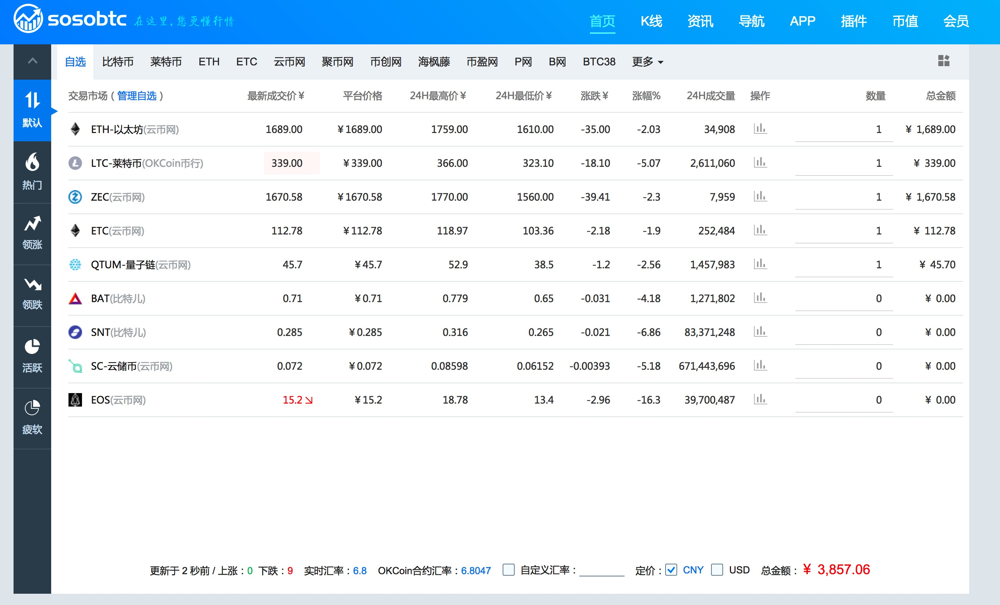
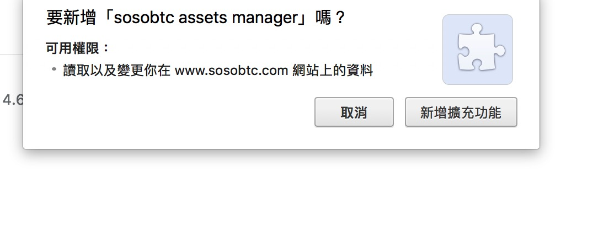
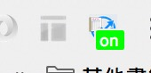

## 简介
这是一个chrome 浏览器扩展， 将sosobtc变成一个数字资产管理器

## 如何安装
chrome商店安装需要翻墙

https://chrome.google.com/webstore/detail/sosobtc-assets-manager/bklkpbghfagofkbgapljhjdffpamcddi

在chrome 浏览器 地址栏输入chrome://extensions 打开扩展管理

将sosobtc-assets-manager.crx文件拖到这里 浏览器就提示是否安装扩展

## 如何使用
安装后浏览器右上角插件栏显示扩展图标

图标下面徽标显示扩展是否开启

off关闭

on开启

打开sosobtc就可以在自定义资产表格里面添加 资产的数量了， 在表格下方显示资产的总价

## todo
由于sosobtc使用了react 有些地方处理的可能不太好， sosobtc升级后可能有影响
